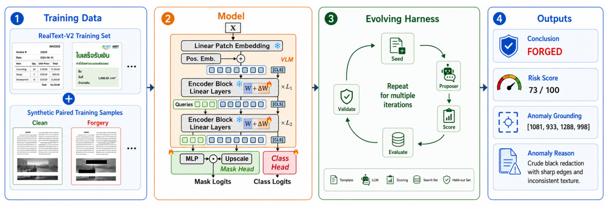

<div align="center">

# SEED

**S**imple ViT and **E**volving Harness for **E**xplainable Text Forgery **D**etection

[]()
[](https://2026.acmmm.org/)
[]()
[](./LICENSE)

</div>

---

> 🏆 **3rd Place Solution** for the ACM MM 2026 GenText-Forensics Challenge — detecting, localizing, and explaining text-centric document forgeries.

---

## 🧠 Overview

SEED is a **modular forgery analysis pipeline** with three stages:

| Stage | Component | Description |
|:-----:|-----------|-------------|
| 1️⃣ | **Synthetic Data** | Similarity-guided forgery generation across 5 manipulation types, with paired (clean, forged) sampling |
| 2️⃣ | **ViT Detector** | DINOv3 ViT-L/16 + LoRA adaptation + EoMT mask head — unified detection & localization |
| 3️⃣ | **Meta-Harness** | Evolving MLLM harness that converts detector outputs into structured forensic reports |

<p align="center">
  
</p>

## ✨ Highlights

<table>
<tr>
  <td>🧊 <b>Frozen Backbone</b></td>
  <td>DINOv3 ViT-L/16 preserves transferable visual priors — only low-rank LoRA residuals are trained</td>
</tr>
<tr>
  <td>🔗 <b>Unified Heads</b></td>
  <td>Single backbone produces both image-level forgery probability and pixel-level localization mask</td>
</tr>
<tr>
  <td>👥 <b>Paired Training</b></td>
  <td>Matched (clean, forged) pairs in each batch force the model to contrast authentic vs. manipulated content</td>
</tr>
<tr>
  <td>🪶 <b>Minimal Parameters</b></td>
  <td>LoRA rank-1 adaptation — extremely few trainable parameters while retaining strong performance</td>
</tr>
<tr>
  <td>🤖 <b>Auto-Evolving Harness</b></td>
  <td>Proposer-evaluator loop auto-discovers effective prompts without manual prompt engineering</td>
</tr>
<tr>
  <td>🧹 <b>Clean Release</b></td>
  <td>Sanitized of hardcoded paths, API keys, and unused legacy code (DCT, multi-expert, gradient checkpointing)</td>
</tr>
</table>

## 📂 Repository Layout

```text
.
├── base_trainer.py                     # 🏋️ Training utilities & metrics
├── cfg.py                              # ⚙️  Runtime configuration
├── ds.py                               # 📦 Datasets & dataloaders
├── main.py                             # 🚂 Train / validation / inference entry point
├── model/
│   ├── eomt_sep_query.py               # 🧠 Main detector (DINOv3 + LoRA + EoMT)
│   ├── lora.py                         # 🪶 Single-expert LoRA modules
│   ├── mask_classification_loss.py     # 🎯 Mask2Former-style loss
│   └── scale_block.py                  # ↗️  ConvTranspose upscaling block
├── meta_harness/
│   ├── test_submission.py              # 📝 Generate challenge-format reports
│   ├── precompute_submission_artifacts.py
│   ├── harness.py                      # 🔧 Report generation base class
│   ├── llm_clients.py                  # 🌐 OpenAI-compatible LLM client
│   ├── overlay.py                      # 🖼️  Mask visualization helpers
│   ├── report_utils.py                 # 📋 Report formatting utilities
│   ├── template_report_boxreasons_coordspanrepair.py
│   └── config.yaml                     # 🔑 LLM API configuration
├── _MM_26_Challenge__GenText_Forensics_3rd_Place/
│   ├── sigconf.tex                     # 📜 Challenge paper source
│   └── fig/seed_overview.png           # 🖼️  Method overview figure
└── TDOC/                               # 🧪 Auxiliary training & generation modules
```

## ⚙️ Environment Setup

```bash
# Create a Python 3.10 environment, then install dependencies
pip install -r requirements.txt
```

| Package | Purpose |
|---------|---------|
| `torch`, `torchvision` | Deep learning framework |
| `timm`, `transformers` | ViT backbone & HuggingFace hub |
| `albumentations` | Image augmentations |
| `opencv-python`, `Pillow` | Image I/O & processing |
| `lmdb`, `six` | DocTamper LMDB loading |
| `openai` | MLLM client for report generation |

## 📊 Data Preparation

Edit `cfg.py` to configure dataset paths — all values are **intentionally empty** by default for the open-source release.

| Config Key | Description |
|------------|-------------|
| `mode` | `train` / `val` / `infer_path_eval` |
| `ckpt` | Path to pretrained checkpoint (`.pth`) |
| `realtextv2_data_root` | Root for RealText-V2 training data |
| `data_root` | DocTamper LMDB root for validation |
| `path_pkl_dir` | Evaluation path-pkl directory |
| `forg_type_dir` | Forgery-type metadata directory |
| `infer_path_eval_pkl` | Image-list pickle for batch inference |
| `infer_path_eval_save_dir` | Output directory for saved predictions |

## 🚀 Training

```bash
# 1. Edit cfg.py → mode='train'
# 2. Set your data paths and GPU count
python main.py
```

> 💡 Training uses `PairedMixedRealTextV2TrainDs` — each batch contains matched (clean, forged) pairs to enforce contrastive learning of manipulation traces.

## 📈 Evaluation

```bash
# 1. Edit cfg.py → mode='val', eval_mode=['loc','det']
python main.py
```

Reports the following per-dataset:

| Metric | Description |
|--------|-------------|
| 🎯 **Loc F1** | Per-image F1 averaged across all samples |
| 🏷️ **Det Acc** | Image-level binary accuracy (authentic vs. forged) |
| 🏷️ **Det F1** | Image-level detection F1 |

## 🔮 Batch Inference

```bash
# 1. Edit cfg.py → mode='infer_path_eval'
# 2. Set infer_path_eval_pkl and infer_path_eval_save_dir
python main.py
```

> 💾 Saves predicted forgery probability maps for every image listed in the pickle file.

## 📝 Report Generation

The `meta_harness/` pipeline converts detector outputs → structured Markdown forensic reports.

```bash
# 🔑 Set your OpenAI-compatible API key
export LINKAPI_API_KEY="your-api-key-here"

# 🖼️  Step 1: Precompute overlays, bounding boxes, data URIs
python meta_harness/precompute_submission_artifacts.py

# 📝 Step 2: Generate reports via MLLM
python meta_harness/test_submission.py
```

> 🤖 This stage is fully automated — no manual prompt engineering required.


